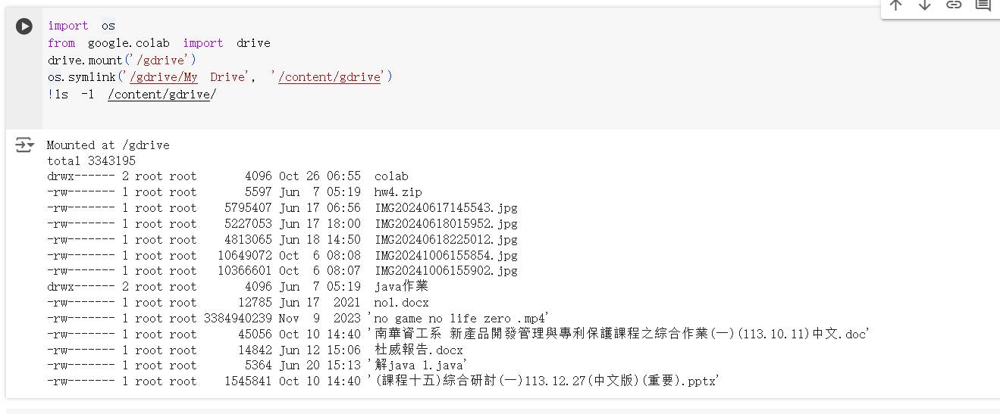
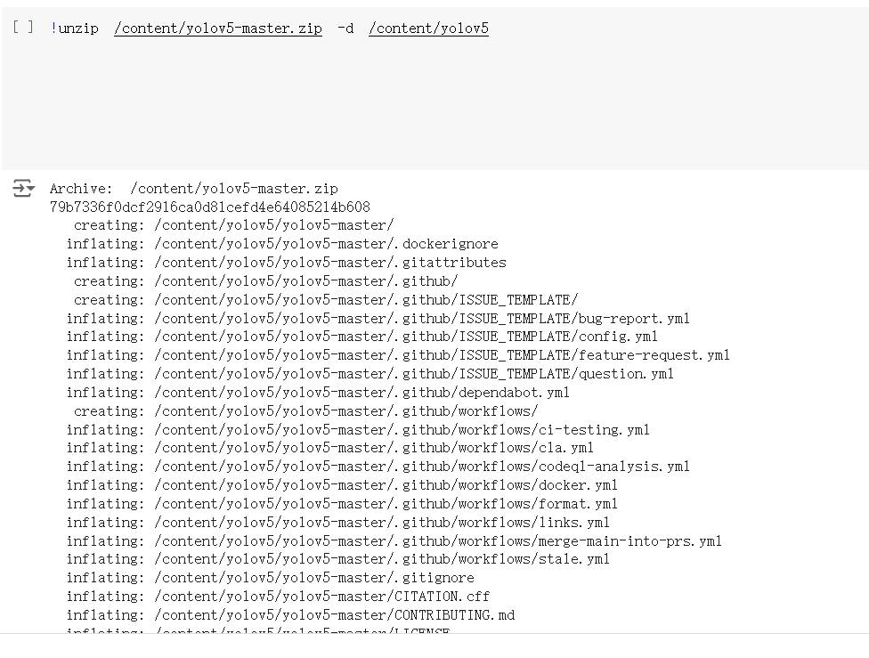
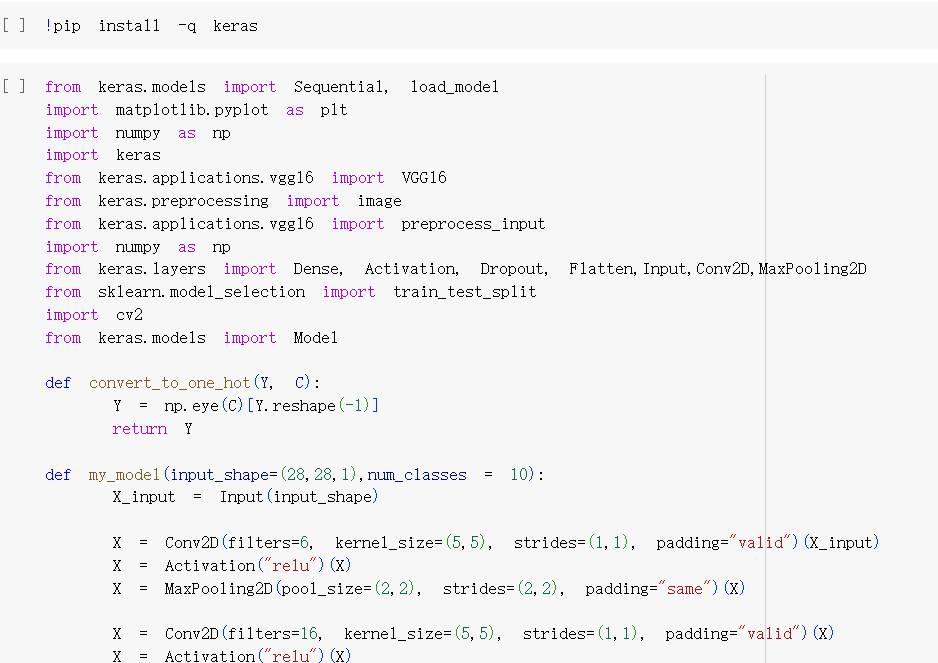
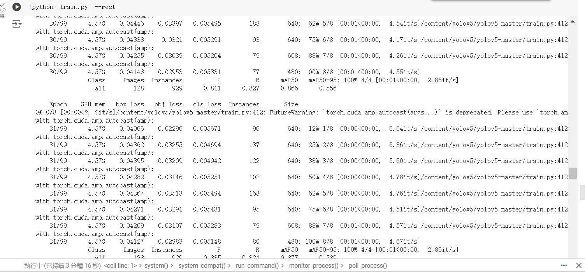
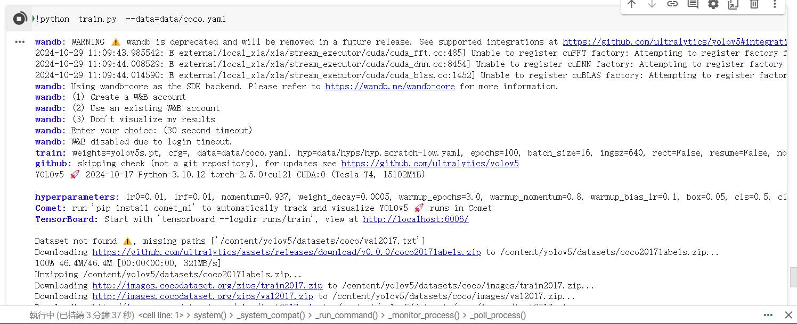

# 人工智慧期中報告 11128004 林峻成 10924149黃子瑜 Colab跑项目_colab运行自己的项目-CSDN博客

#步驟:1.掛載谷歌雲盤 2.解壓縮並進入yolov5目錄下 3.安裝環境 !pip install -r requirements.txt 4.啟動矩陣推理訓練 5.結果

#步驟1:掛載谷歌雲盤

#步驟2:解壓縮並進入yolov5目錄下

#步驟3:安裝環境 !pip install -r requirements.txt

#步驟4:啟動矩陣推理訓練

#步驟5:結果

# 參考資料 https://blog.csdn.net/qq_51070956/article/details/134503497
